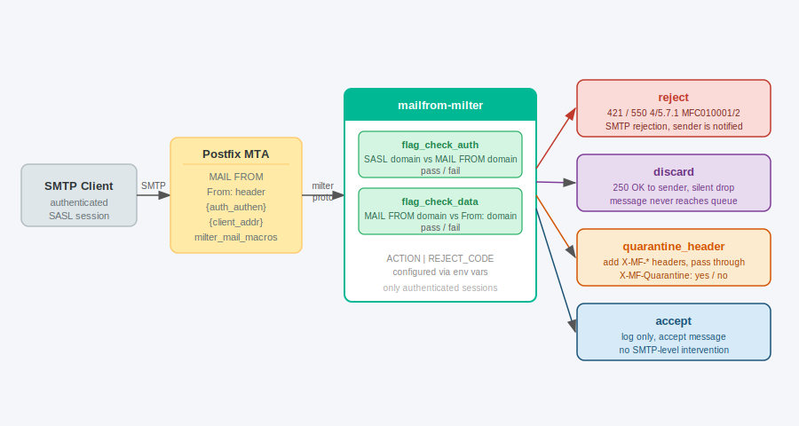

# mailfrom-milter

[](https://github.com/0kaba0hub/k8s_mailfrom/actions/workflows/ci.yaml)
[](LICENSE)
[](app/go/go.mod)
[](https://github.com/0kaba0hub/k8s_mailfrom/pkgs/container/mailfrom)

Postfix **milter** written in Go that enforces alignment between the SMTP envelope sender (`MAIL FROM`) and the `From:` message header.

Licensed under **GPLv3** — see [LICENSE](LICENSE).



---

## The problem

When a mail server hosts multiple domains, an authenticated user can set `MAIL FROM` to their own domain but forge the `From:` header with a different domain. The DKIM signer signs using the `From:` domain — producing a valid DKIM signature for a domain the sender does not own.

**This milter rejects such messages before DKIM signing occurs.**

Only authenticated SMTP sessions (SASL) are checked. Unauthenticated connections (inbound MX delivery) pass through without inspection.

---

## Checks

For every authenticated session the milter performs two checks:

| Flag | Check | Values |
|:---|:---|:---|
| `flag_check_auth` | SASL username domain vs `MAIL FROM` domain | `pass` / `fail` |
| `flag_check_data` | `MAIL FROM` domain vs `From:` header domain | `pass` / `fail` |

---

## Actions

Configured via the `MF_ACTION` environment variable.

| Action | On `flag_check_auth` fail | On `flag_check_data` fail | On both pass |
|:---|:---|:---|:---|
| `reject` | `421 4.7.1 … MFC010001` | `421 4.7.1 … MFC010002` | log + accept |
| `discard` | silent drop, log `MFC020001` | silent drop, log `MFC020002` | log + accept |
| `quarantine_header` | log + add headers (`X-MF-Quarantine: yes`) | log + add headers (`X-MF-Quarantine: yes`) | log + add headers (`X-MF-Quarantine: no`) |
| `accept` | log only, accept | log only, accept | log only, accept |

Default: `reject`.

---

## Headers added

For `quarantine_header` action only:

| Header | Value |
|:---|:---|
| `X-MF-Envelope-From` | `MAIL FROM` address |
| `X-MF-From` | Address extracted from `From:` header |
| `X-MF-Quarantine` | `yes` if any check failed, `no` if all passed |

---

## Log format

Every processed authenticated message produces one JSON log entry:

```json
{
  "time": "...",
  "level": "INFO",
  "msg": "milter",
  "envelope_from": "user@attacker.com",
  "auth_user": "user@attacker.com",
  "flag_check_auth": "pass",
  "from_header": "ceo@victim.com",
  "flag_check_data": "fail",
  "return_code": "reject"
}
```

`return_code` values: `reject`, `discard`, `accept`.

---

## Postfix configuration

```
smtpd_milters = inet:mailfrom.mail.svc.cluster.local:10031
milter_mail_macros = i {mail_addr} {client_addr} {client_name} {auth_authen} {auth_type}
milter_default_action = accept
```

`{auth_authen}` must be present in `milter_mail_macros` (included in Postfix defaults).

---

## Environment variables

| Variable | Default | Description |
|:---|:---|:---|
| `LISTEN_ADDR` | `0.0.0.0:10031` | TCP address to listen on |
| `MF_ACTION` | `reject` | `reject` / `discard` / `quarantine_header` / `accept` |
| `LOG_LEVEL` | — | Set to `debug` for verbose per-message logging |

---

## Stack

- Go 1.26
- [`0kaba0hub/go-milter`](https://github.com/0kaba0hub/go-milter) v0.4.1 — fork of `emersion/go-milter` with `slog` logging and `sync.Pool` write buffer
- [`0kaba0hub/go-message`](https://github.com/0kaba0hub/go-message) v0.18.1 — fork of `emersion/go-message` (indirect dep of go-milter, no changes)
- Both forks have weekly upstream release monitors; `go.mod` uses `replace` directives
- Alpine 3.21 runtime image

---

## Directory layout

```
app/go/
|-  main.go
|-  Dockerfile
|-  go.mod
\-  go.sum
helm/
|-  Chart.yaml
|-  values.yaml
\-  templates/
    |-  deployment.yaml
    \-  service.yaml
helm_values/
\-  values-sandbox.yaml
argocd-app.yaml
.github/workflows/ci.yaml
```

---

## Deploy

### Kubernetes (ArgoCD)

```sh
kubectl apply -f argocd-app.yaml
```

### Local

```sh
docker build -t mailfrom:dev app/go/
docker run --rm -p 10031:10031 -e MF_ACTION=accept -e LOG_LEVEL=debug mailfrom:dev
```

---

## CI

Push to `main` → builds `ghcr.io/0kaba0hub/mailfrom:<sha>` + `latest` for `linux/amd64`, auto-commits the new tag to `helm_values/values-sandbox.yaml`.
