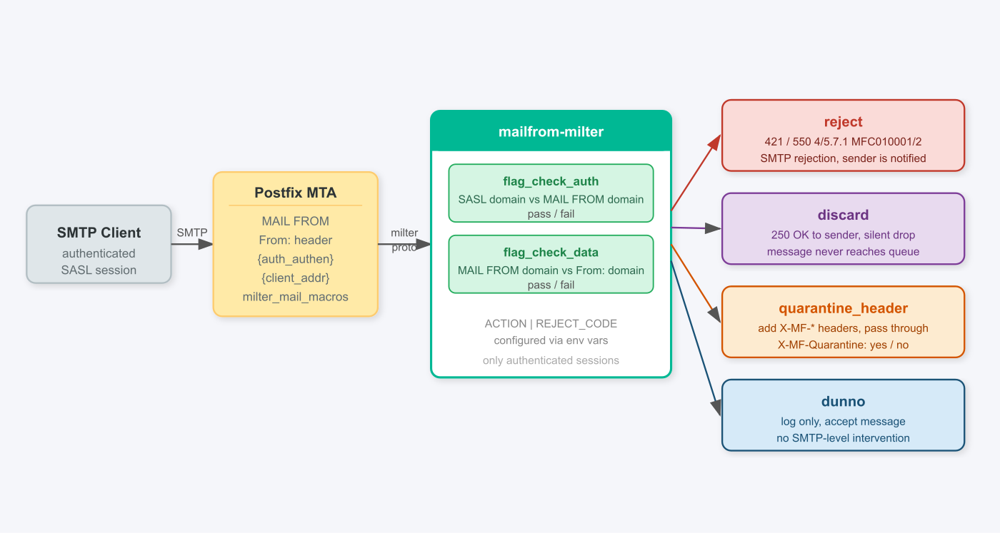

```{=latex}
\begin{center}
{\LARGE\bfseries TECHNICAL DOCUMENTATION}\\[16pt]
{\large\bfseries Service: k8s\_mailfrom}
\end{center}
\vspace{10pt}
```

## mailfrom-milter

Postfix milter written in Go that enforces domain alignment between the SMTP envelope sender (`MAIL FROM`) and the `From:` message header for authenticated sessions. Prevents DKIM domain spoofing: an authenticated user setting `MAIL FROM` to their own domain but forging `From:` with a victim domain would produce a valid DKIM signature for a domain they do not own. This milter rejects such messages before DKIM signing occurs.

Only authenticated SMTP sessions (SASL) are checked. Unauthenticated connections (inbound MX delivery) pass through without inspection.

**Architecture**

{ width=100% }

**Stack**

- Go 1.26 (`alpine:3.21` runtime image)
- `github.com/emersion/go-milter` v0.4.1 *(third-party, vendored in `app/go/vendor/`)*
- `log/slog` --- structured JSON logging

**Directory layout**

```
k8s_mailfrom/
|- app/go/
|  |- main.go
|  |- Dockerfile
|  |- go.mod
|  \- go.sum
|- helm/
|  |- Chart.yaml
|  |- values.yaml
|  \- templates/
|     |- deployment.yaml
|     \- service.yaml
|- helm_values/
|  \- values-sandbox.yaml
|- doc/
|- argocd-app.yaml
\- .github/workflows/ci.yaml
```

## Checks

For every authenticated session two checks are performed:

| Flag | Check | Values |
|:---|:---|:---|
| `flag_check_auth` | SASL username domain vs `MAIL FROM` domain | `pass` / `fail` |
| `flag_check_data` | `MAIL FROM` domain vs `From:` header domain | `pass` / `fail` |

## Actions

Configured via the `MF_ACTION` environment variable:

| Action | On check fail | On both pass |
|:---|:---|:---|
| `reject` | SMTP reject with `REJECT_CODE 4/5.7.1` | log + accept |
| `discard` | silent drop (`250 OK` to sender), log | log + accept |
| `quarantine_header` | add `X-MF-Quarantine: yes` headers, log | add `X-MF-Quarantine: no` headers, log |
| `accept` | log only, accept | log only, accept |

Headers added for `quarantine_header` action:

| Header | Value |
|:---|:---|
| `X-MF-Envelope-From` | `MAIL FROM` address |
| `X-MF-From` | Address extracted from `From:` header |
| `X-MF-Quarantine` | `yes` if any check failed, `no` if all passed |

## Environment Variables

| Variable | Default | Description |
|:---|:---|:---|
| `LISTEN_ADDR` | `0.0.0.0:10031` | TCP address to listen on |
| `MF_ACTION` | `reject` | `reject` / `discard` / `quarantine_header` / `accept` |
| `REJECT_CODE` | `421` | SMTP reply code for reject: `421` (temp) or `550` (permanent) |
| `LOG_LEVEL` | --- | Set to `debug` for verbose per-message logging |

## Deploy

Managed by ArgoCD. Apply the ArgoCD Application manifest:

```sh
kubectl apply -f argocd-app.yaml
```

Postfix configuration:

```
smtpd_milters = inet:mailfrom.mail.svc.cluster.local:10031
milter_mail_macros = i {mail_addr} {client_addr} {client_name} {auth_authen} {auth_type}
milter_default_action = accept
```

Local development:

```sh
docker build -t mailfrom:dev app/go/
docker run --rm -p 10031:10031 -e MF_ACTION=accept -e LOG_LEVEL=debug mailfrom:dev
```

## Logging

Every processed authenticated message produces one JSON log entry:

```
{
  "time": "...", "level": "INFO", "msg": "milter",
  "envelope_from": "user@attacker.com",
  "auth_user": "user@attacker.com",
  "flag_check_auth": "pass",
  "from_header": "ceo@victim.com",
  "flag_check_data": "fail",
  "return_code": "reject"
}
```

`return_code` values: `reject`, `discard`, `accept`. Enable verbose logging without code changes: `LOG_LEVEL=debug`.
